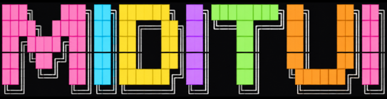
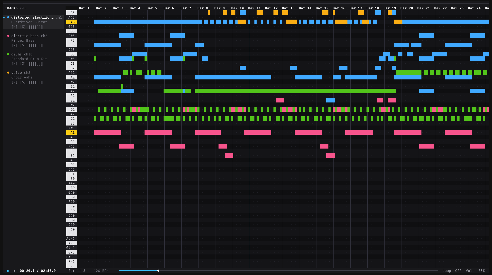

<p align="center">
  
</p>

<p align="center">
  <strong>A terminal MIDI player and multi-track piano roll visualizer built with Rust and Ratatui.</strong>
</p>

<p align="center">
  
</p>

`miditui` renders a multi-track piano roll with truecolor track palettes, interactive scrubbing, and real-time audio playback through your default speakers using SoundFont synthesis or a built-in fallback synth.

## Features

- **Multi-Track Piano Roll**: High-resolution semitone grid with labeled piano keys, beat rulers, and distinct 24-bit color palettes for each track.
- **Real-Time Playhead**: Smooth vertical playhead tracking with auto-scrolling viewport follow mode.
- **Built-in Audio Synthesis**:
  - Automatically detects and loads General MIDI SoundFont (`.sf2`) files via `rustysynth` and `cpal`.
  - Includes a zero-dependency polyphonic waveform synthesizer fallback so sound works immediately on any machine without downloading extra files.
- **Interactive Controls**:
  - Full keyboard shortcuts for playback, scrubbing, zooming, octave shifting, and track muting/soloing.
  - Mouse and touch tap support: click tracks to select, click `[M]` / `[S]` to toggle mute/solo, and click the transport bar to scrub.
- **Demo Mode**: Run without any arguments to generate and play an expressive 4-track jam (Overdriven Guitar, Electric Bass, Lead Synth, and Drums).

## Installation

### Prerequisites

Make sure you have Rust installed (1.85+ recommended), along with ALSA headers on Linux:

```bash
# Ubuntu / Debian
sudo apt-get install libasound2-dev pkg-config

# Fedora / RHEL
sudo dnf install alsa-lib-devel pkg-config

# Arch Linux
sudo pacman -S alsa-lib pkgconf
```

### Build from source

```bash
git clone https://github.com/pinkpixel-dev/miditui.git
cd miditui
cargo build --release
```

The compiled binary will be placed at `target/release/miditui`.

## Usage

### Run the built-in demo song

```bash
cargo run --release
```

### Play a local MIDI file

```bash
cargo run --release -- path/to/song.mid
```

### Use a custom SoundFont (.sf2)

```bash
cargo run --release -- path/to/song.mid --sf2 /path/to/soundfont.sf2
```

You can also set the `SOUNDFONT` environment variable:

```bash
export SOUNDFONT=/path/to/GeneralUser_GS.sf2
cargo run --release -- path/to/song.mid
```

### Inspect MIDI file details without opening the TUI

```bash
cargo run --release -- path/to/song.mid --info
```

## Controls

### Playback & Transport

| Key | Action |
| :--- | :--- |
| `Space` | Play / Pause |
| `Left` / `h` | Seek backward 5 seconds |
| `Right` / `l` | Seek forward 5 seconds |
| `[` / `]` | Seek backward / forward 1 measure |
| `Home` | Rewind to start |
| `r` | Toggle repeat / loop mode |
| `,` / `.` (`<` / `>`) | Decrease / increase master volume |

### Viewport & Zoom

| Key | Action |
| :--- | :--- |
| `Up` / `k` | Scroll piano pitch upward |
| `Down` / `j` | Scroll piano pitch downward |
| `+` / `=` | Zoom time axis in |
| `-` / `_` | Zoom time axis out |
| `f` | Toggle auto-follow playhead |

### Tracks & Solo/Mute

| Key | Action |
| :--- | :--- |
| `Tab` / `Shift+Tab` | Select next / previous track |
| `m` | Toggle mute on selected track |
| `s` | Toggle solo on selected track |
| `1` .. `9` | Quick toggle mute for tracks 1 through 9 |

### Mouse & Touch

- Click any track row to select it.
- Click `[M]` or `[S]` on a track to mute or solo.
- Click `⏵` / `⏸` on the transport bar to toggle playback.
- Click anywhere on the progress bar to scrub directly to that position.
- Mouse wheel scrolls pitch up and down.

### General

| Key | Action |
| :--- | :--- |
| `?` | Toggle help overlay modal |
| `Esc` / `q` | Close help modal / Quit application |

## License

Apache 2.0. See [LICENSE](LICENSE) for details.
